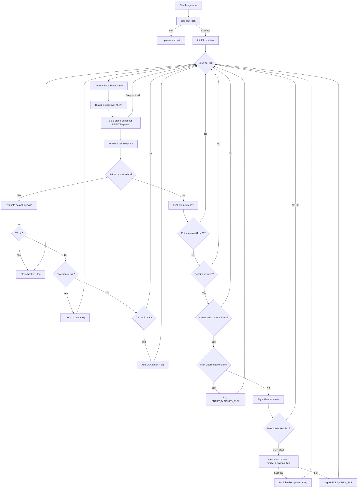

# NowTrading Bot Flowchart

## Notes

- Entry gate: minute `01/31`, session window, one basket per 30-minute block, daily max baskets.
- Signal stack: `RSI H1/M30/M15 alignment + M15 breakout + spread`.
- Basket management: TP mode (money/ATR), emergency exit, DCA spacing.
- Risk guard can block new entries and/or DCA.
